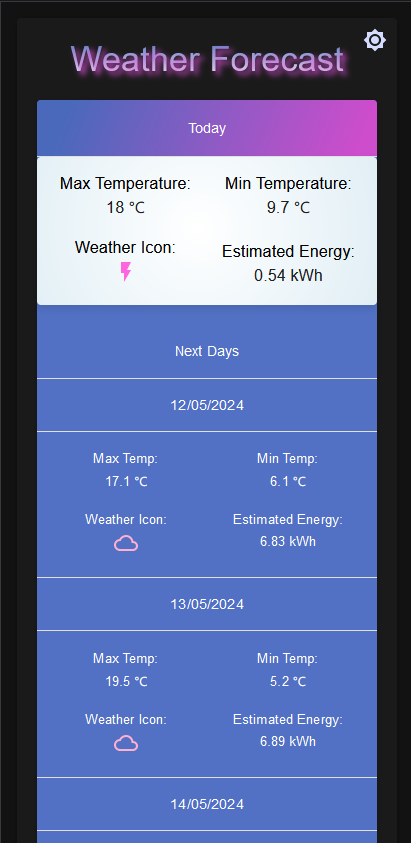

<b>Fork README.md</b>

# Next.js Hello World

This example shows the most basic idea behind Next. We have 2 pages: `src/pages/index.js` and `src/pages/about.js`. The former responds to `/` requests and the latter to `/about`. Using `next/link` you can add hyperlinks between them with universal routing capabilities.

The app in this repo is deployed at https://next-js.onrender.com.

## Deploy as Node Web Service

Click the button below to deploy this app on Render.

## Deploy as Static Site

1. Modify the code:
    1. In `render.yaml`, replace the definition of the service named `next-js` with the definition that is commented out.
    2. In `next.config.mjs`, uncomment the line that sets `output: "export"`.

2. Commit the code changes to your repository.

3. Click the Deploy to Render button.

## Weather Forecast Frontend
### Project Description 
Weather Forecast App for the Next 7 Days for User's Location. It is possible to obtain weather information for any place in the world by selecting it with a click on the map and then clicking on the displayed marker. The user's location is marked on the map - by clicking on the blue marker, detailed information about the current location can be obtained. The app features a dark mode and ensures responsiveness. 
### Try it out at the link below: (There may be delays in loading the page.)

<a href="https://weatherappfrontend-gd5m.onrender.com/">--> Weather Forecast App <--</a>

### Tech Stack

	

<ul>
    <li>Next.js</li>
    <li>Material UI</li>
    <li>Leaflet</li>
</ul>

### Project 
#### Start Page -> Light And Dark Mode

#### Start Page Mobile -> Light And Dark Mode

#### Weather in Choosen Location 
